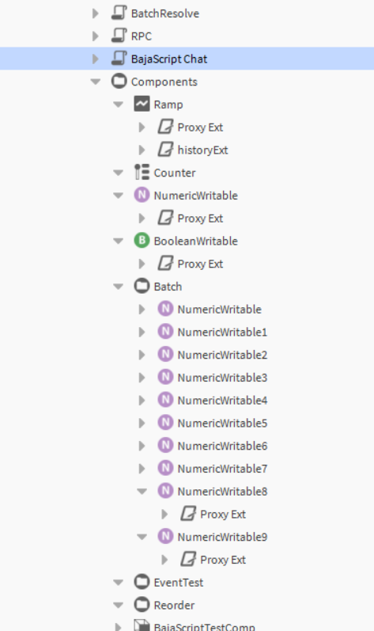

# Components Tree Structure

The image displays a hierarchical tree structure of components within the BajaScript/Niagara environment.

## Hierarchy Overview
- **Baja**
    - **Baja Components**
        - **Baja objects**
        - **Baja services**
        - **Baja utilities**
        - **Baja types**
            - **Baja values**
            - **Baja constants**
            - **Baja exceptions**
        - **Baja interfaces**

This structure represents the organization of the BajaScript API, separating core objects, services, utility functions, and the type system (including values, constants, and exceptions) and interfaces.