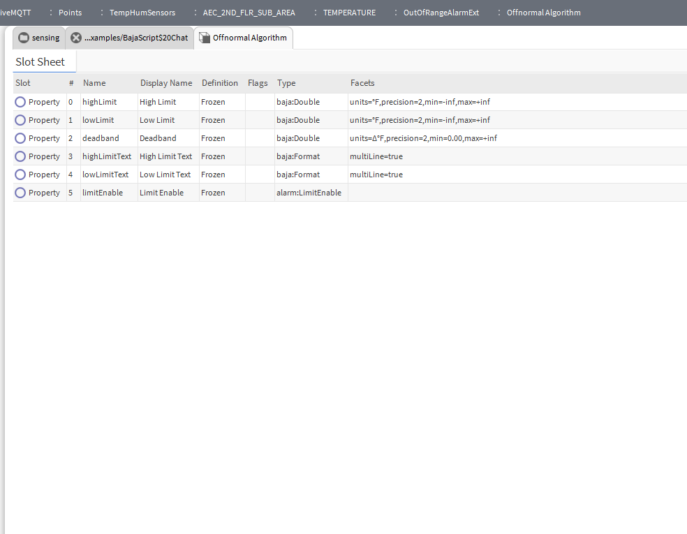

# Offnormal Algorithm

The image provides a flow diagram/logic explanation for the Offnormal Algorithm used in Niagara for alarm state transitions.

## Logic Flow
The algorithm determines the state of a point based on its value relative to defined thresholds:

1. **Value Input**: The current value of the point is monitored.
2. **Comparison**: The value is compared against the High and Low thresholds.
3. **State Determination**:
    - If the value exceeds the High threshold $\rightarrow$ **High Alarm** (Offnormal).
    - If the value falls below the Low threshold $\rightarrow$ **Low Alarm** (Offnormal).
    - If the value is between the thresholds $\rightarrow$ **Normal**.
4. **Hysteresis/Deadband**: The diagram indicates a deadband region to prevent rapid oscillation between Normal and Offnormal states (chattering).

## Summary
The Offnormal Algorithm is the primary mechanism for triggering alarms when a sensor value deviates from its acceptable operating range.