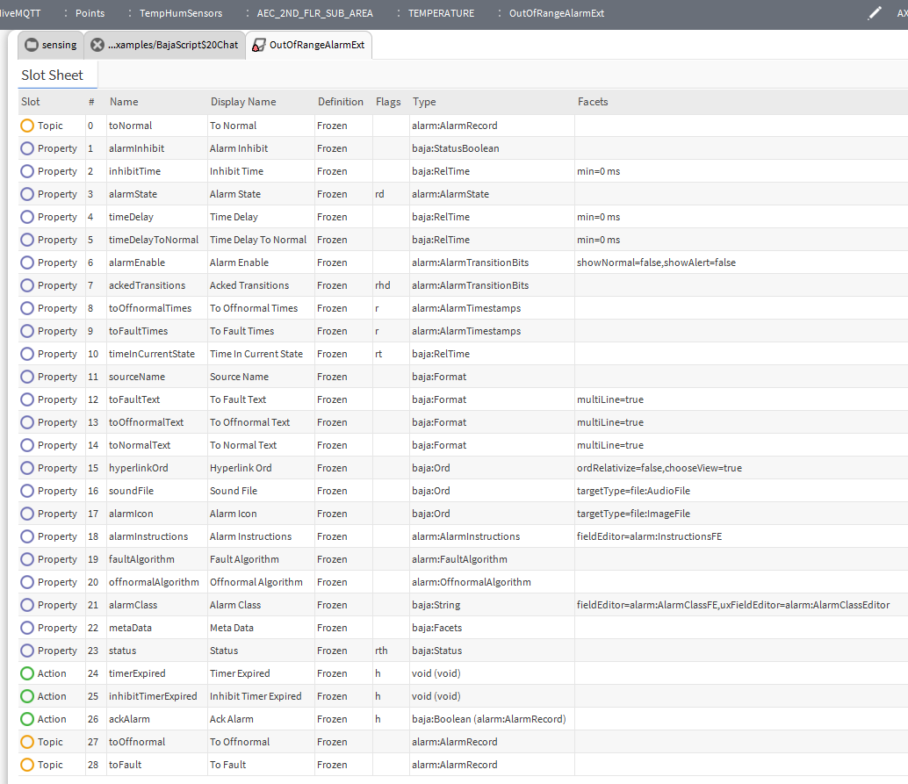

# Out of Range Alarm Extension Slot Sheet

This document describes the slot configuration for the `BOutOfRangeAlarmExt` extension.

## Slot Definitions

| Slot Name | Type | Description |
| :--- | :--- | :--- |
| **HighLimit** | Double | The upper threshold for the alarm. |
| **LowLimit** | Double | The lower threshold for the alarm. |
| **Hysteresis** | Double | The value used to prevent alarm chatter. |
| **AlarmState** | AlarmState | Current state of the alarm (Normal, High, Low). |
| **Priority** | Integer | The priority assigned to the alarm. |
| **AlarmText** | String | The descriptive text associated with the alarm. |

## Behavior
- **High Alarm**: Triggered when `Value > HighLimit`.
- **Low Alarm**: Triggered when `Value < LowLimit`.
- **Normal**: Triggered when the value returns within the limits plus hysteresis.