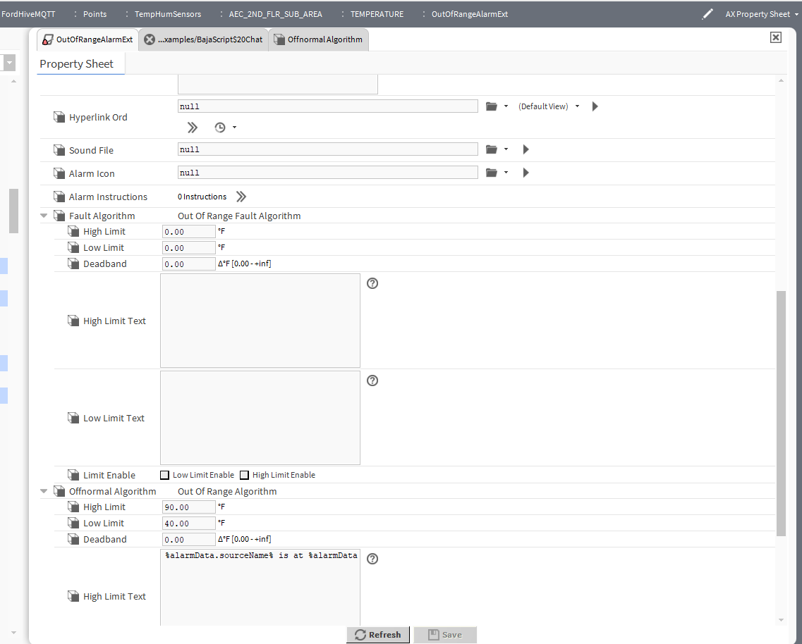

# AEC Alarm Extension

The image illustrates the configuration and logic for the AEC Alarm Extension.

## Key Components
- **Input Value**: The monitored sensor reading.
- **Thresholds**: Specifically defined for AEC (Architectural, Engineering, and Construction) requirements.
- **Condition Logic**: 
    - Checks if the value is within the "Allowable" range.
    - If the value is outside the range, it transitions to an "Alarm" state.
- **Snooze/Acknowledge**: Includes mechanisms for acknowledging the alarm to silence notifications while the condition persists.

## Use Case
Used specifically for environmental monitoring where precise thresholds for temperature or humidity are required to maintain building compliance.